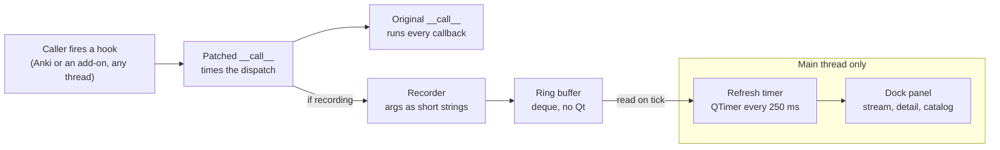

# Hook Tracer Add-on Spec

Oct 5, 2026 · @Renato Oliveira

## Overview and goals

Hook Tracer is a developer add-on that records every Anki hook and filter as it fires and shows the stream live in a dockable panel. It answers "which hook fires when I do X, with what arguments, and who is listening?" without reading generated code or sprinkling print statements.

It serves two audiences: add-on authors learning the hook surface, and the core team debugging how add-ons (including AnkiHub's) interact with Anki.

Goals for v1:

- Capture every fire of every generated hook and filter in `aqt.gui_hooks` and `anki.hooks`, with timestamp, thread, duration and a short summary of arguments.
- Show which callbacks are registered on a hook at fire time, attributed to the add-on that owns them.
- For filters, show the value going in and coming out, and flag when it changed.
- Stay out of the way: near-zero overhead when paused, and never change Anki's behaviour or swallow an exception.
- Ship a pure-Python core that is testable headlessly, so it can be built with AI assistance and verified by tests.

## Non-goals

- Tracing the Rust backend or the protobuf service calls. Only Python hooks are in scope.
- Tracing JavaScript in reviewer or editor webviews, beyond what Python hooks already report.
- Editing, blocking or replaying hook calls. The tracer observes; it never intervenes.
- Distribution to end users on AnkiWeb in v1. It is a dev tool first.

## Background: how Anki's hooks work

Every hook is a generated class with one module-level instance, so a single patch point per class catches every fire. The generator is [pylib/tools/hookslib.py](https://raw.githubusercontent.com/ankitects/anki/main/pylib/tools/hookslib.py); the hook definitions live in `qt/tools/genhooks_gui.py` and `pylib/tools/genhooks.py`.

What the generated code gives us:

- Each hook becomes a class named like `_ReviewerDidAnswerCardHook`, with a class-level `_hooks` list and `append`, `remove` and `count` methods. The instance is bound to the plain name, e.g. `reviewer_did_answer_card`.
- A hook has a return type of `None`; a filter has a real return type and threads its first argument through each callback, returning the final value.
- `__call__` loops over `_hooks`. If a callback raises, Anki removes that callback from the list and re-raises.
- Some hooks also call the legacy `anki.hooks.runHook` or `runFilter` after the new-style callbacks, for old add-ons.

Two consequences shape the design. Because `__call__` is looked up on the class, patching `type(hook).__call__` intercepts every fire. And because a raising callback gets removed, the tracer must never raise from inside a dispatch, or it would silently unregister someone else's callback.

## Design

The tracer patches `__call__` on each discovered hook class, records one small event per fire into a ring buffer, and lets a main-thread timer feed the UI.



The wrapper always calls the original dispatch; recording is a side effect that can be switched off or fail without changing what Anki does.

**Discovery.** For `aqt.gui_hooks` and `anki.hooks`, iterate `vars(module)` and keep objects that have `append`, `remove`, `count` and a `_hooks` list, and whose class name starts with `_` and ends in `Hook` or `Filter`. The suffix gives the kind. De-duplicate by class, since a module can re-export another's hooks.

**Patching.** Store each class's original `__call__` in a registry, then replace it with a wrapper. The wrapper snapshots the callback list before dispatch, because Anki removes a callback that raises:

```python
def make_wrapper(name, kind, original):
    @functools.wraps(original)
    def traced(self, *args, **kwargs):
        if not state.recording or name in state.muted or guard.active:
            return original(self, *args, **kwargs)
        start = time.perf_counter_ns()
        callbacks = tuple(self._hooks)
        result, error = None, None
        try:
            result = original(self, *args, **kwargs)
        except BaseException as exc:
            error = exc
            raise
        finally:
            safe_record(name, kind, callbacks, args, result, error, start)
        return result

    return traced
```

`safe_record` catches every exception from the recorder and sets the thread-local guard while it runs.

**Event model.** A frozen `TraceEvent` dataclass: `seq`, `t_ms`, `hook`, `kind`, `thread`, `duration_ms`, `callbacks` (qualified name and owner pairs), `args` (repr strings), `filter_in`, `filter_out`, `changed` and `error`. Argument summaries come from `reprlib.Repr` capped at `repr_max_len`. For filters, `changed` is true when the returned value is not the first argument and compares unequal.

**Owner attribution.** Anki imports each add-on as a package named after its folder, so the first component of a callback's `__module__` identifies the add-on. Unwrap bound methods via `__func__` and `functools.partial` via `.func` first. Map the folder to a display name with the add-on manager; callbacks from `aqt` or `anki` are shown as core.

**UI handoff.** A `QTimer` on the main thread fires every 250 ms, takes events with `seq` above the last one seen, and appends them to the table model with `beginInsertRows`. Qt never touches the buffer, and the buffer never touches Qt.

## UI

The UI is a `QDockWidget` on the main window, opened from the sole **Tools > Hook Tracer** menu entry, with two tabs: a live stream and a catalog. Recording is started/stopped in the panel, not from a second Tools-menu action; the optional `trace_on_startup` config can still capture events before opening the panel.

**Stream tab**, a `QTableView` backed by a `QAbstractTableModel` over the event buffer:

| Column | Content |
| --- | --- |
| Time | Milliseconds since tracing started |
| Hook | Hook name, with module prefix (`gui` or `anki`) |
| Kind | hook, filter or legacy |
| Thread | Thread name; anything off the main thread is highlighted |
| Duration (ms) | Total dispatch time |
| Callbacks | Number registered at fire time |
| Args | One-line summary of the arguments |

Toolbar actions: start/stop recording, clear, a filter box (substring or regex on hook name), "hide hooks with no callbacks", and mute/unmute the selected hook. Hiding is display-only; a quick **Mute recording for this hook** action also stops events from entering the ring buffer (and the temporary console feed), so high-frequency hooks cannot evict useful events. Make the muted state and unmute control visible even when the hook has no rows in the stream. Session mutes are temporary by default; offer an explicit option to persist them through the add-on config.

**Detail pane**, below the table, for the selected event: full argument reprs, the callback list with each callback's qualified name and owning add-on, the filter's input and output with a changed flag, and the exception if a callback raised.

**Catalog tab**: every discovered hook with its kind, fire count this session, current callback count and owning add-ons. Sorting by callback count is the quickest way to see which add-ons hook into what.

**Export**: write the current buffer to a JSON Lines file. The save dialog warns that arguments can include card and note content.

## Configuration

Settings live in the add-on's `config.json`, documented in `config.md`, and are edited through Anki's add-on config dialog.

| Key | Default | Meaning |
| --- | --- | --- |
| `trace_on_startup` | `false` | Start recording when Anki launches, before the panel is opened |
| `buffer_size` | `5000` | Maximum events kept in memory; oldest are dropped |
| `capture_args` | `true` | Store argument summaries; off records names and timings only |
| `repr_max_len` | `200` | Truncation length for each argument repr |
| `muted_hooks` | `[]` | Hook names never recorded |
| `trace_legacy` | `false` | Reserved for optional `runHook`/`runFilter` tracing (milestone 6); disabled in v1 |

The persisted mute list is also editable from the panel. A temporary session mute does not write config unless the user explicitly chooses to keep it. Large media downloads can flood the phase-2 console with `gui.media_sync_did_progress`; measure its frequency and impact in a real session before making it a default mute. Muting must never disable Anki's hook dispatch itself.

## Performance and safety

The tracer wraps code that runs on every keystroke and every card render, so the rules below are requirements, not nice-to-haves.

1. **Never raise from the wrapper.** All recording code sits in a `try/except Exception` that drops the event and increments an internal error counter shown in the panel. Exceptions from the original dispatch are re-raised unchanged.
2. **Cheap when paused.** The wrapper checks one boolean and calls the original `__call__` directly. Target: overhead on a paused fire within noise of an unpatched call, measured with `timeit` in tests.
3. **No object retention.** Events store strings and numbers only, never references to `Card`, `Note`, editors or webviews. This avoids keeping closed windows or old collections alive.
4. **Bounded memory.** The buffer is a `collections.deque(maxlen=buffer_size)`.
5. **No re-entrancy loops.** The panel's own Qt and webview activity can fire hooks. A thread-local flag skips recording while the tracer's own code is running.
6. **Thread-safe handoff.** Hooks can fire off the main thread, for example inside background operations. Recording only appends to the deque; Qt widgets are touched only by the main-thread timer.
7. **Clean unpatch.** Disabling restores every original `__call__`, so a session without the tracer looks exactly like stock Anki.
8. **Local only.** Nothing is sent anywhere. Export is an explicit user action.

## Project layout and testing

The core has no Qt imports, so the riskiest code is covered by fast headless tests before any UI exists.

```
hook_tracer/
  __init__.py        # entry point: menu action, config, start/stop
  manifest.json
  config.json
  config.md
  core/
    discovery.py     # find hook instances in a module
    patching.py      # install/uninstall __call__ wrappers
    recorder.py      # TraceEvent, ring buffer, arg summaries
    owners.py        # map a callback to its add-on folder
  ui/
    dock.py          # QDockWidget, toolbar, timer
    stream_model.py  # QAbstractTableModel over the buffer
    detail.py
    catalog.py
tests/
  fake_hooks.py      # hand-written classes matching the generated template
  test_discovery.py
  test_patching.py
  test_recorder.py
  test_integration_pylib.py
```

Tooling: `uv` or a venv with the `anki` and `aqt` packages from PyPI pinned to the target Anki version, plus `pytest`, `mypy` and `ruff`. For manual runs, symlink `hook_tracer/` into the profile's `addons21` folder.

Test plan:

- **Fake hooks.** `fake_hooks.py` copies the shape of generated hook and filter classes. Tests cover: every fire is recorded; filter input and output are captured; a raising callback is still removed by the original code and the exception still propagates; unpatch restores the exact original function.
- **Wrapper failure.** Force the recorder to raise and assert the dispatch result is unchanged.
- **Threads.** Fire a fake hook from several threads and check event count and thread names.
- **Real pylib hooks.** Open a `Collection` on a temp path, patch `anki.hooks`, perform an action such as adding a note, and assert the expected hook names appear.
- **Overhead.** A `timeit` comparison of paused-patched versus unpatched calls, with a loose threshold so it is not flaky.
- **Manual checklist** in a real Anki build: open the panel, review a few cards, open the editor and browser, run a sync, confirm no errors in the debug console and that the panel stays responsive.

## Milestones

Each milestone ends with something you can run, so you can stop after any of them with a useful tool.

1. **Headless core.** Discovery, patching and recorder with the fake-hook and pylib tests passing. Done when `pytest` is green and a script prints a trace of adding a note.
2. **Console trace in Anki.** The add-on patches on load and prints events to the debug console while recording. Once the panel exists, its recording button replaces the temporary menu toggle. Done when reviewing a card prints the expected reviewer hooks.
3. **Stream panel.** Dock widget, table model, timer refresh, pause, clear and name filter. Done when the panel stays responsive during a 100-card review session.
4. **Detail, owners and catalog.** Detail pane with callback owners and filter diffs, plus the catalog tab.
5. **Polish.** Config keys, mute list, JSON Lines export, error counter.
6. **Stretch.** Per-callback timing, legacy `runHook`/`runFilter` tracing, a "record this action" button that captures only the events between two clicks.

**Phase 0 scope decision:** explicit legacy tracing belongs to milestone 6, not
milestone 5. In v1, `trace_legacy` is reserved and defaults to `false`; a `true`
value must be treated as unsupported, left disabled, and explained to the user.
Generated hooks still execute their original legacy delegation unchanged, and
that work remains included in the enclosing generated dispatch duration. Separate
legacy events are deferred.

## Open questions

- [ ] Per-callback timing needs our own dispatch loop that mirrors the generated one, including removal on exception. Is the extra fidelity worth the risk of drifting from Anki's semantics?
- [ ] Can `aqt.gui_hooks` be imported in tests without a `QApplication`? If not, discovery tests for GUI hooks need a Qt fixture.
- [ ] Which hooks are noisy enough to mute by default? Measure fire counts in milestone 2 before choosing.
- [ ] Should the tracer load first among add-ons so it sees registrations made at startup, and is there a supported way to do that?
- [ ] Which Anki versions do we support? The `_hooks` class-attribute layout should be checked against the oldest one.
- [ ] Should this become an internal team tool, a public AnkiWeb add-on, or a feature of Anki's own debug console?
